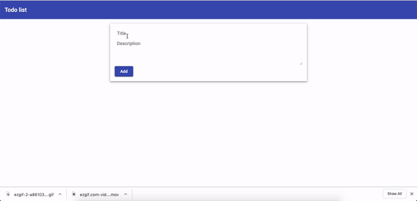
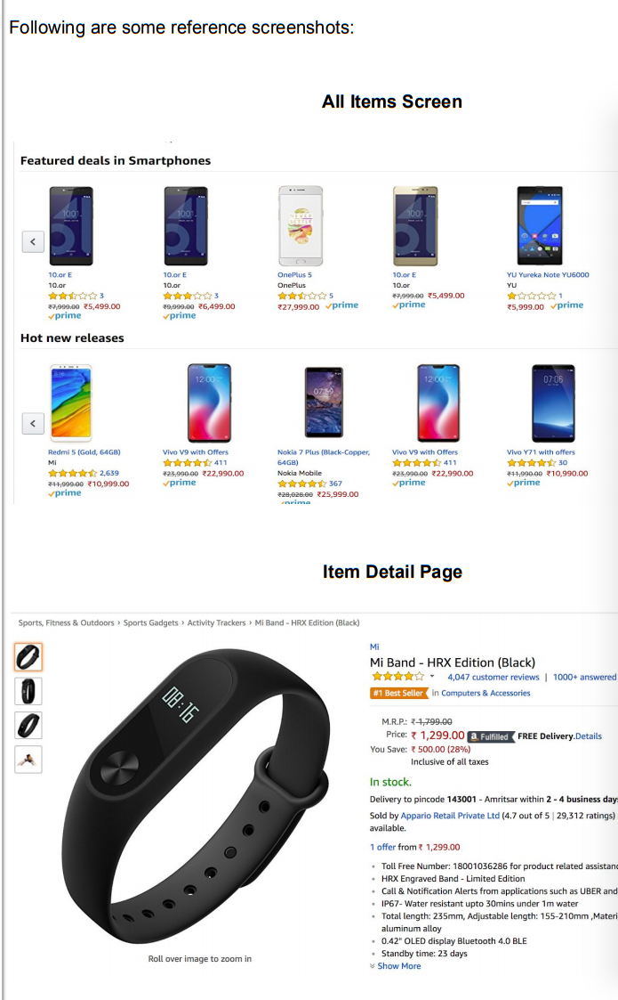
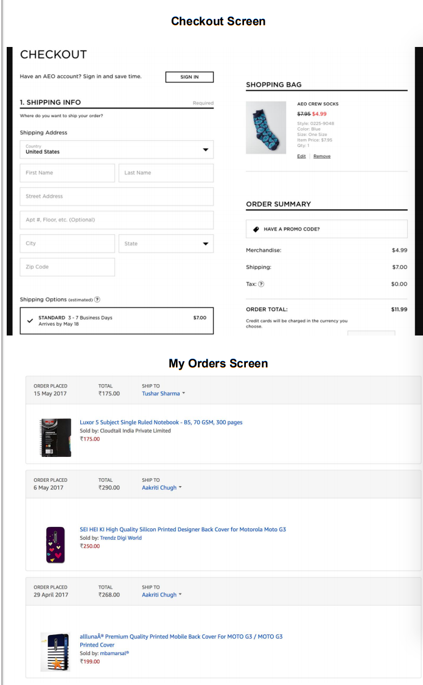

# Tech-Challenge

The problem statements mentioned below includes:

* Programming problems where you can judge your problem solving skills.

* A small application where the you can test your development skills.

## Problem 1: Check palindrome strings

Given a string, check if the reverse of that string is equal to the orignal string.

Example: 

**Case 1**

Input: Sample

Output: elpmaS

**Case 2**

Input: 12321

Output: 12321

```javascript
function reverse(input) {
    let rev = '';
    /*
    Compute the reverse of the input string
    and return it
    */
    return rev;
}
function main() {
    for(let index=0;index<arguments.length;index++) {
        const input = arguments[index];
        const rev = reverse(input);
        console.log(`${rev} is ${input === rev? '':'not'} equal to ${input}`);    
    }
}

main('Sample','12321');

```

## Problem 2: **Perfect sum problem**

Given an array of integers and a sum, the task is to print all subsets of given array with sum equal to given sum.

Input: = 6, [2, 3, 5, 6, 8, 10], 10

Output: 
        
        5 2 3

        2 8

        10

Explanation: 

First input 6 is the number of elements in the subsequent array

Second input an array of 6 elements

Third input 10 is the perfect sum which needs to be searched in the array.

The output gives all the subsets of the `Second input` array which have the sum equal to `Third input (10)`


Input: = 5, [1, 2, 3, 4, 5], 10

Output : 
        
        4 3 2 1 

        5 3 2 

        5 4 1 

Explanation: 

First input 5 is the number of elements in the subsequent array

Second input an array of 5 elements

Third input 10 is the perfect sum which needs to be searched in the array.

The output gives all the subsets of the `Second input` array which have the sum equal to `Third input (10)`


## Problem 3: **Scheduling problem**

A recruiter has decided to take interviews of *n* attendees with the help of *m* interviewers at a venue which has *r* rooms. Each interview takes exactly 2 hours. A day starts from 9:00 am
and ends at 6:00pm with a break from 2:00pm to 3:00pm. Design this system to produce the schedule of the interviews to be taken and also display if some of the interviews cannot be
taken.

Eg. 

**Input**

Attendees: 5
Interviewers: 3(A, B, C)
Rooms: 2

**Output**

| Attendee | Interviewer | Room | Slot |
| -------- | ----------- | ---- | ---- |
| 1        | A           | R1   | 9-11 |
| 2        | B           | R2   | 9-11 |
| 3        | C           | R1   | 11-1 |
| 4        | B           | R2   | 11-1 |
| 5        | A           | R1   | 3-5  |


## Problem 4: **Empty a string**

Given a string **str**, the task is to make the string empty with the given operation. In a single operation, you can pick some characters of the string (each of the picked characters should have the same frequency) and remove them from the string. Print the total operations required to make the string empty.


**Input:** str = “aabbccc”
**Output:** 2
In one operation, characters ‘a’ and ‘b’ can be removed since both have the same frequency.
Second operation can remove character ‘c’ having frequency 3.
Total 2 operations are required.

**Input:** str = “kochartechisawesome”
**Output:** 3


## Problem 5: **Domain mapping**

Given two domains (`source` and `target`), each with a defined upper and lower bound. You have to map a value from source domain to the target domain.


**Case1**: 

**Input**: 0 1 10 50 0.5

**Output**: 30

**Explanation**: Input consists of 5 numbers. First two numbers representing the lower and upper bound of the source domain. Next two numbers representing lower and upper bound of target domain. Last number is a value from the source domain whose corresponding value in the target domain has to be found.

The output `30` is the number corresponding to the  value 0.5 in the source domain

**Case 2**

**Input**: 10 40 5 10 20

**Output**: 6.67

## Problem 6: Sort an array

Given is an array of integers. Values in the array can be both negative or positive. You are required to sort the array using the absolute value of elements of array.

**Case 1**
Input: [1, 4, -3, 2, 7]
Output: [1, 2, -3, 4, 7]

Explanation: The input is an array of random integers. The output is a sorted array where sorting is done irrespective of the Sign of the number.

## Problem 7: Find occurance of characters

Given is a random string from which you are supposed to count the occurances of each character and display it in ascesnding order of the characters.

Constraint:
- Input string cannot contain spaces
- Input string can only contain lowercase characters
- Input string cannot contain characters other a-z

**Case 1:**
Input: rohitistyping
Output: g1h1i3n1o1p1r1s1t2y1

Explanation: The output is a string which contains each character from the input along with its occurance.

**Case 2:**
Input: indiaisgreat
Output: a2d1e1g1i3n1r1s1t1


## Todo app

After completing the assignment the app should look like:



User should be able to add a todo item, by specifying a title and a description.
On adding a todo item, it should be saved in the db.

**Validations:**

Both `title` and `description` are required
Both `title` and `description` must have atleast 3 characters

**Marking a todo item as complete**

To mark a todo item as complete user should be able to click the `Done` button at the bottom of
the todo item and as a result the todo item should get updated in the DB as completed.

**Reloading the screen**

On reloading the screen, all the todo items which are not complete yet should appear.


## Online Selling

E-Commerce
Make an e-commerce books application with the following features.

- Home Screen with a minimum of 20 books. 
- A Top-Nav-Bar or Left-Side-Nav for quick navigation.
- Each Book will have its Detail page and a Buy Now or Add to Cart Button.
- Buy Now will quickly take the user to the Checkout Screen while the Add to Cart Button will store the Book in the Shopping Cart.
- The detail page of the item will have its picture, price, and features.
- A Checkout Screen where the user can review the Billing Information and the list of items in the cart.
- A My Order Screen which will list all the books the user has bought till date.
- We strongly recommend you to
  - Use the json hosted @ https://api.myjson.com/bins/j82l2  to get a list of books.
  - Do not hard code any data in the application

- See the below screenshots for reference




